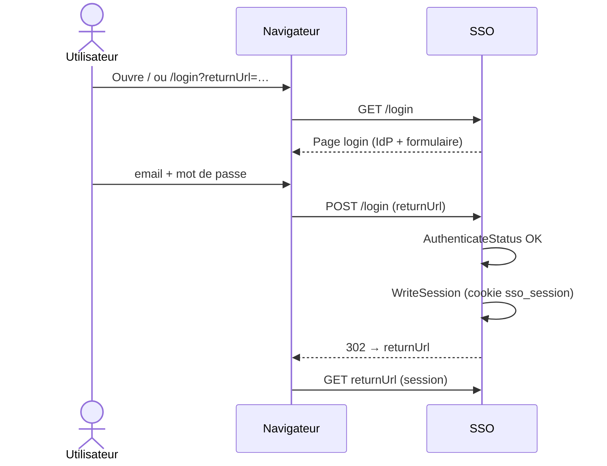
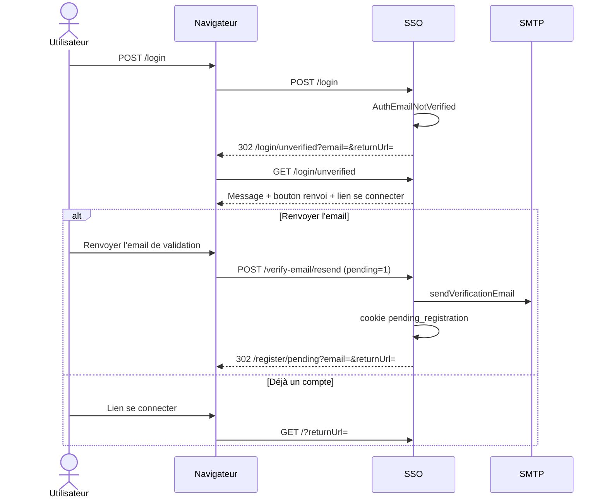
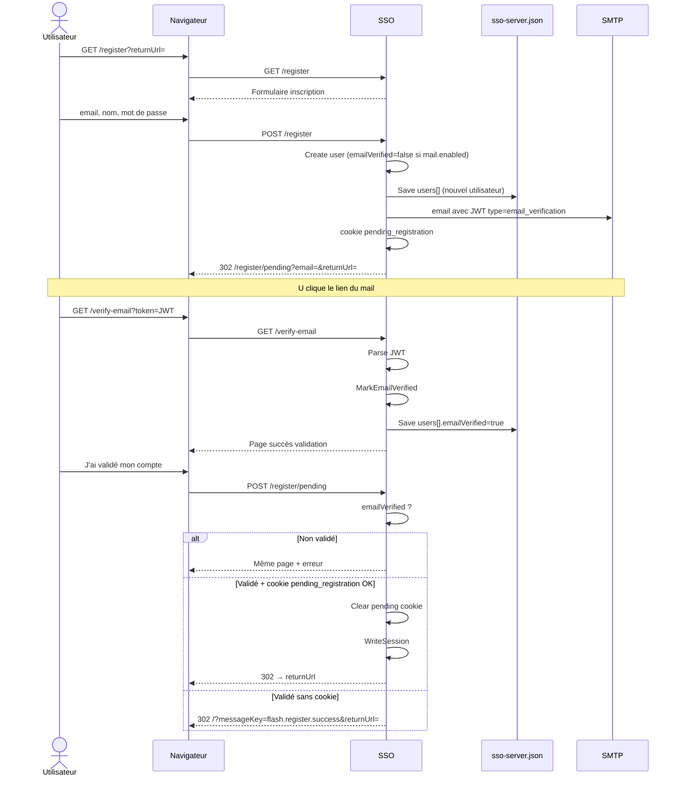
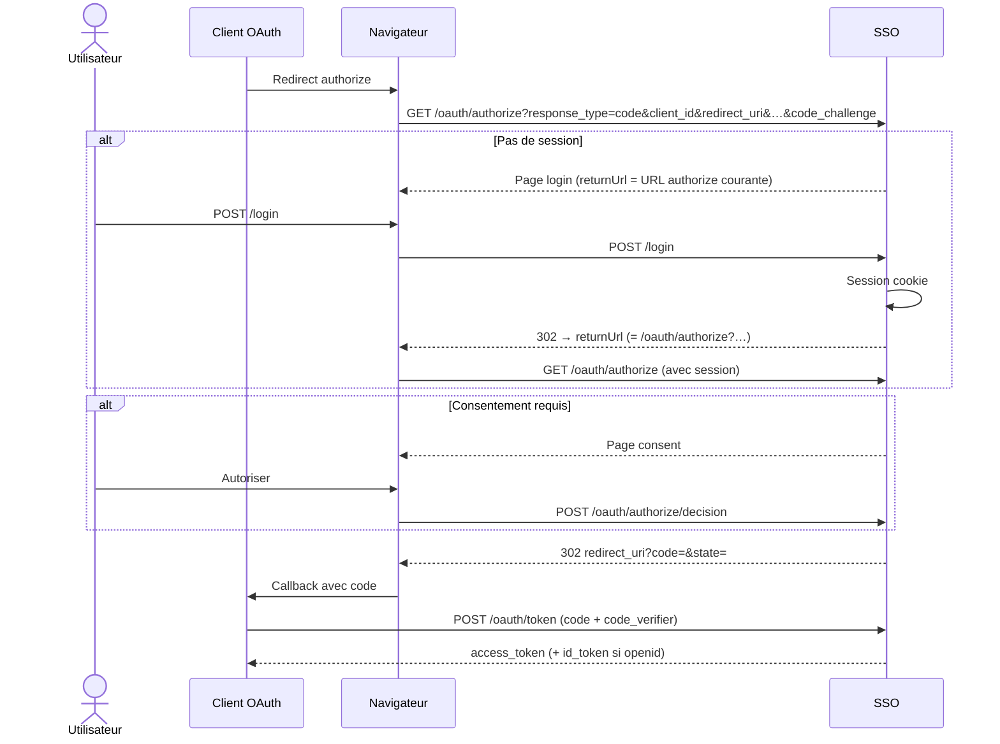
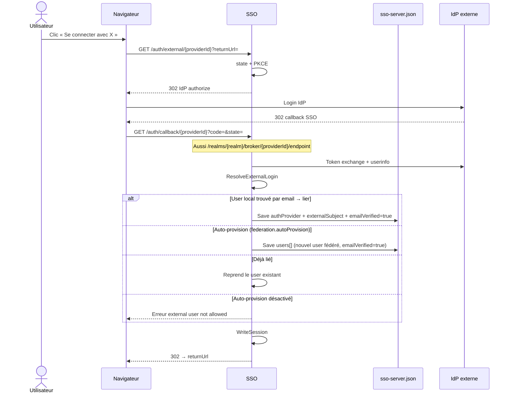
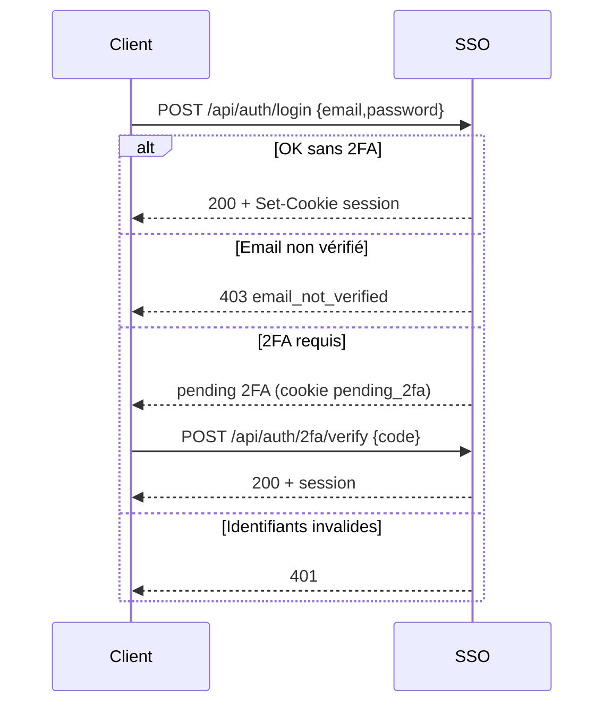

# Callflows de login (datanode-sso)

Flux HTML et OAuth du serveur SSO Go. Les chemins sont relatifs à `server.publicBaseUrl`
(ex. `https://oauth2.tregorechecs.fr` → pas de préfixe ; `http://localhost:8080/sso` → préfixe `/sso`).

Les flèches `S->>J` marquent une réécriture **en place** de `sso-server.json` (`loader.Save`).

## Légende cookies JWT


| Cookie                                      | Type JWT               | Rôle                                                                                 |
| ------------------------------------------- | ---------------------- | ------------------------------------------------------------------------------------ |
| `datanode_sso_session`                      | `sso_session`          | Session authentifiée                                                                 |
| `datanode_sso_session_pending_registration` | `pending_registration` | Login temporaire après inscription / renvoi mail (TTL = `emailVerificationTtlHours`) |
| `datanode_sso_session_pending_2fa`          | `pending_2fa`          | 2FA en cours (API)                                                                   |


## Écritures JSON (`loader.Save`)


| Opération                             | Quand                          | Champs typiques                                                  |
| ------------------------------------- | ------------------------------ | ---------------------------------------------------------------- |
| `Create`                              | `POST /register`               | `users[]` + nouvel user (`emailVerified: false` si mail enabled) |
| `MarkEmailVerified`                   | `GET /verify-email`            | `users[].emailVerified = true`                                   |
| `ResolveExternalLogin` (lier)         | callback IdP, email déjà connu | `authProvider`, `externalSubject`, `emailVerified: true`         |
| `ResolveExternalLogin` (provisionner) | callback IdP + `autoProvision` | nouveau user fédéré (`emailVerified: true`)                      |


---


## 1. Connexion locale (compte validé)




---


## 2. Connexion locale (email non validé)




---


## 3. Inscription + validation email + auto-login




### Lien mail

```
{publicBaseUrl}/verify-email?token={JWT}
```

Claims JWT `email_verification` : `sub` (userId), `email`, `type`, `exp` (TTL heures).

---


## 4. OAuth authorize → login → consent → code




---


## 5. Fédération IdP externe (Google / Microsoft / …)




---


## 6. Login JSON API




---


## Pages HTML liées


| Route                     | Rôle              | Écriture JSON        |
| ------------------------- | ----------------- | -------------------- |
| `POST /register`          | Inscription       | `Create` → `users[]` |
| `GET /verify-email`       | Activation mail   | `MarkEmailVerified`  |
| `GET /auth/callback/{id}` | Retour fédération | liaison ou provision |


---


## Config utile

```json
{
  "security": {
    "publicRegistrationEnabled": true,
    "emailVerificationTtlHours": 48,
    "sessionCookieSecure": true
  },
  "mail": {
    "enabled": true,
    "smtpHost": "…",
    "smtpPort": 587,
    "fromAddress": "…",
    "startTls": true
  }
}
```

Si `mail.enabled` est `false`, les comptes créés sont utilisables immédiatement (pas de `emailVerified=false`).